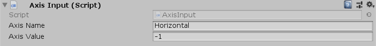

[#manual/axis-input]

## Axis Input

Axis Input is a https://docs.unity3d.com/ScriptReference/MonoBehaviour.html[MonoBehaviour^] that will set a value on an input axis when an object is clicked. This can be used in conjunction with the <<reference/input-helper.html,InputHelper>> to create virtual axes for things like on screen buttons in a mobile game that move a character directionally or to trigger actions.

See the _"MazeUI"_ scene in the Maze project for an example usage.

NOTE: Because this uses Unity's IPointerHandler interface the object must have either a https://docs.unity3d.com/ScriptReference/UI.Graphic.html[Graphic^] or a https://docs.unity3d.com/ScriptReference/Collider.html[Collider^] and the https://docs.unity3d.com/ScriptReference/Canvas.html[Canvas^] or https://docs.unity3d.com/ScriptReference/Camera.html[Camera^] must have a https://docs.unity3d.com/ScriptReference/UI.GraphicRaycaster.html[GraphicRaycaster^] or https://docs.unity3d.com/ScriptReference/EventSystems.PhysicsRaycaster.html[PhysicsRaycaster^] respectively.

### Fields

[cols="1,2"]
|===
| Name	| Description

| Axis Name	| The name of the input axis to set when clicked
| Axis Value	| The value to set the input axis to when clicked
|===

ifdef::backend-multipage_html5[]
<<reference/axis-input.html,Reference>>
endif::[]