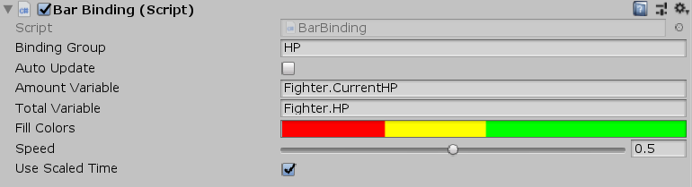

[#manual/bar-binding]

## Bar Binding

Bar Binding is a <<variable-binding,Variable Binding>> that will set the fill amount and blend color of a https://docs.unity3d.com/ScriptReference/UI.Image.html[Image^] based on bindings to two int or float variables. If speed is greater than 0.0f then changes will be animated to between values. Custom color gradients can also be set depending on the fill amount. Bar Bindings are useful for things like health and progress bars.

See the _"Battle"_ scene in the Battle project for an example usage.

NOTE: Make sure the _Image Type_ property on https://docs.unity3d.com/ScriptReference/UI.Image.html[Image^] is set to _Filled_ for the Bar Binding to work properly.

### Fields

[cols="1,2"]
|===
| Name	| Description

| Amount Variable	| The link:reference/variable-reference.html[VariableReference^] that represents the fractional amount of the fill
| Total Variable	| The link:reference/variable-reference.html[VariableReference^] that represents the total amount of the fill
| Fill Colors	| The https://docs.unity3d.com/ScriptReference/Gradient.html[Gradient^] to base the blend color on
| Speed	| The speed at which to animate changes (in percentage of the total per second)
| Use Scaled Time	| Whether to base the speed off of scaled time or real time
|===

ifdef::backend-multipage_html5[]
<<reference/bar-binding.html,Reference>>
endif::[]