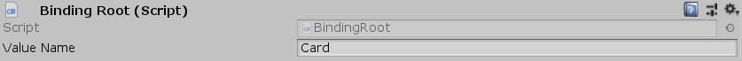

[#manual/binding-root]

## Binding Root

Binding Root is a https://docs.unity3d.com/ScriptReference/MonoBehaviour.html[MonoBehaviour^] that acts as a root object for all child <<manual/variable-binding.html,Variable Bindings>> to bind data on. Binding Roots have a _Value_ property that can be accessed through <<reference/variable-reference.html,Variable References>> via the _Value Name_ property.  _Value_ can be set from a derived class such as <<manual/object-binding-root.html,Object Binding Root>> or through a <<manual/set-binding-node.html,Set Binding Node>>. When accessing variables on a Binding Root, the search will cascade upward to the next Binding Root in the hierarchy with the the default variable store on the <<manual/composition-manager.html,Composition Manager>> as the base. <<manual/selection-control.html,Selection Controls>> and <<manual/menu.html,Menus>> use Binding Roots on each of their child <<manual/menu-item.html,Menu Items>> to group each item's data.

See the "Card" prefab in the CardGame project for an example usage.

### Fields

[cols="1,2"]
|===
| Name	| Description

| Value Name	| The name of the variable that child <<manual/variable-binding.html,Variable Bindings>> can use in order to access this Binding Root's _Value_.
|===

ifdef::backend-multipage_html5[]
<<reference/binding-root.html,Reference>>
endif::[]