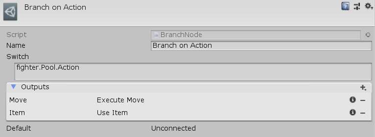

[#manual/branch-node]

## Branch Node

A Branch Node is an <<manual/instruction-graph-node.html,Instruction Graph Node>> that will branch to any number of different nodes based on the the string evaluation of an <<reference/expression.html,Expression>>. This can be thought of similar to a switch statement in C#. Create a Branch Node in the menu:Create[Control Flow > Branch] menu of the Instruction Graph Window.

See <<topics/graphs-3.html,Control Flow>> for more information. +
See the node named _"Branch on Action_" on the _"Battle"_ <<manual/instruction-graph.html,Instruction Graph>> in the Battle project for an example usage.

### Fields

[cols="1,2"]
|===
| Name	| Description

| Switch	| The <<reference/expression.html,Expression>> to run to determine the node to branch to
| Outputs	| The dictionary of names to nodes to branch to based on _Switch_
| Default	| The default node to go to if the value of _Switch_ is not in the _Outputs_ dictionary
|===

ifdef::backend-multipage_html5[]
<<reference/branch-node.html,Reference>>
endif::[]