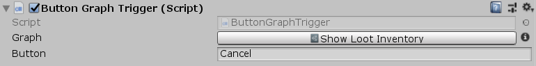

[#manual/button-graph-trigger]

## Button Graph Trigger

Button Graph Trigger is an <<manual/instruction-trigger.html,Instruction Trigger>> that will run its <<manual/instruction-graph.html,Instruction Graph>> when the the specified _Button_ is pressed.

See the _"Loot Level"_ scene in the Loot project for an example usage.

### Fields

[cols="1,2"]
|===
| Name	| Description

| Button	| The name of the button that will trigger the <<manual/instruction-graph.html,Instruction Graph>>
|===

ifdef::backend-multipage_html5[]
<<reference/button-graph-trigger.html,Reference>>
endif::[]