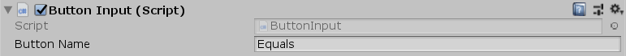

[#manual/button-input]

## Button Input

Button Input is a https://docs.unity3d.com/ScriptReference/MonoBehaviour.html[MonoBehaviour^] that will set an input button to be pressed the object is clicked on. This is useful for things like on screen buttons in a mobile game to trigger actions.

See the _"Calculator"_ scene in the Calculator project for an example usage.

NOTE: Because this uses Unity's IPointerHandler interface the object must have either a https://docs.unity3d.com/ScriptReference/UI.Graphic.html[Graphic^] or a https://docs.unity3d.com/ScriptReference/Collider.html[Collider^] and the https://docs.unity3d.com/ScriptReference/Canvas.html[Canvas^] or https://docs.unity3d.com/ScriptReference/Camera.html[Camera^] must have a https://docs.unity3d.com/ScriptReference/UI.GraphicRaycaster.html[GraphicRaycaster^] or https://docs.unity3d.com/ScriptReference/EventSystems.PhysicsRaycaster.html[PhysicsRaycaster^] respectively.

### Fields

[cols="1,2"]
|===
| Name	| Description

| Button Name	| The name of the button to be pressed when the object is clicked
|===

ifdef::backend-multipage_html5[]
<<reference/button-input.html,Reference>>
endif::[]