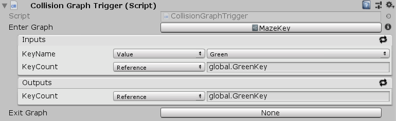

[#manual/collision-graph-trigger]

## Collision Graph Trigger

Collision Graph Trigger is an <<manual/instruction-trigger.html,Instruction Trigger>> that will run its <<manual/instruction-graph.html,Instruction Graph>> on collisions. Collision Graph Trigger works in conjunction with a <<collision-notifier.html,Collision Notifier>> which will call the respective Enter and Exit functions on the Collision Graph Trigger.

See the _"Maze1"_ scene in the Maze project for an example usage.

### Fields

[cols="1,2"]
|===
| Name	| Description

| Enter Graph	| The <<instruction-graph.html,Instruction Graph>> to run when this object is collided with.
| Exit Graph	| The <<instruction-graph.html,Instruction Graph>> to run when this object is exited.
|===

ifdef::backend-multipage_html5[]
<<reference/collision-graph-trigger.html,Reference>>
endif::[]