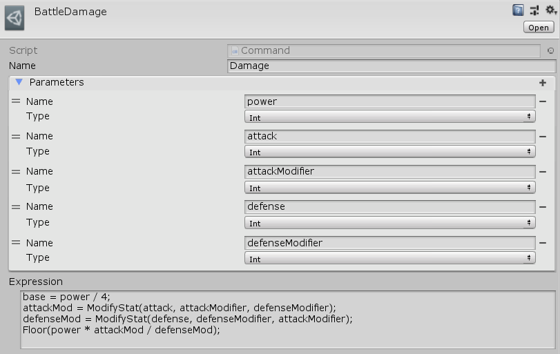

[#manual/command]

## Command

A Command is a https://docs.unity3d.com/ScriptReference/ScriptableObject.html[Asset^] that can be created to give access to custom <<reference/expression.html,Expression>> logic that can be reused and called from other <<reference/expression.html,Expressions>>. This is useful when you have more complex logic that will be calculated in multiple locations. Commands can unify that logic so that it doesn't have to be written multiple times and changing it once changes it for all instances that use it. Create a Command through the menu:Create[PiRho Soft > Command] menu in the project view.

IMPORTANT: Because a Command is a "Resource" it must be placed in a folder called "Commands" as a direct subfolder of a "Resources" folder so that it can be loaded and accessed on demand.

See <<topics/variables/custom-commands.html,Commands>> for more information. +
See the "Apply Damage" <<manual/expression-node.html,Expression Node>> of the "BattleScratch" <<manual/instruction-graph.html,Instruction Graph>> in the Battle project for an example usage.

### Fields

[cols="1,2"]
|===
| Name	| Description

| Name	| The string name of the Command that is used in an <<reference/expression.html,Expression>> to call this command
| Parameters	| The list of <<reference/variable.html,Variables>> that should be passed to this Command - these can be accessed by name in _Expression_
| Expression	| The <<reference/expression.html,Expression>> that this command will run when it is called
|===

ifdef::backend-multipage_html5[]
<<reference/command.html,Reference>>
endif::[]