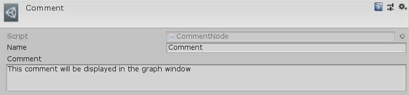

[#manual/comment-node]

## Comment Node

A Comment Node is an <<manua/instruction-graph-node.html,Instruction Graph Node>> that is used for debugging purposes. It is inert during runtime and is purely used to display custom info about how a graph is functioning. Create a Comment Node in the menu:Create[Debug > Comment] menu of the Instruction Graph Window.

See <<topics/graphs-1.html,Graphs>> for more information on instruction graphs. +

### Fields

[cols="1,2"]
|===
| Name	| Description

| Comment	| The string value of the comment
|===

ifdef::backend-multipage_html5[]
<<reference/comment-node.html,Reference>>
endif::[]