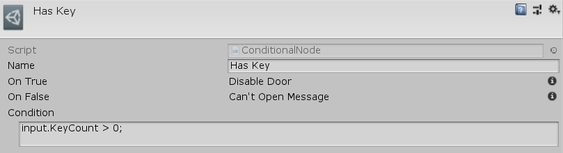

[#manual/conditional-node]

## Conditional Node

A Conditional Node is an <<manual/instruction-graph-node.html,Instruction Graph Node>> that branches the progression of an <<manual/instruction-graph.html,Instruction Graph>> based on the `true` or `false` evaluation of an <<reference/expression.html,Expression>>. Create a Conditional Node in the menu:Create[Control Flow > Conditional] menu of the Instruction Graph Window.

See the _"HasKey"_ node in "MazeDoor" <<instruction-graph,Instruction Graph>> in the Maze project for an example usage.

### Fields

[cols="1,2"]
|===
| Name	| Description

| Condition	| The <<reference/expression.html,Expression>> to evaluate to determine the progression of the graph
|===

ifdef::backend-multipage_html5[]
<<reference/conditional-node.html,Reference>>
endif::[]