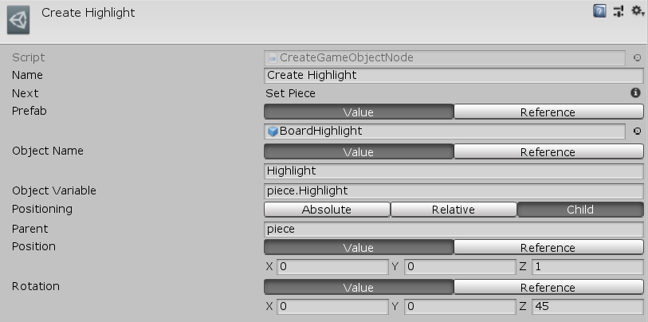

[#manual/create-game-object-node]

## Create Game Object Node

A Create Game Object Node is an <<manual/instruction-graph-node.html,Instruction Graph Node>> that will spawn a Prefab at the given Name, Position, and Rotation relative to the world, another object, or as a child object. The created object can optionally be stored in a given <<reference/variable-reference.html,VariableReference>> so that it can be accessed later. Create a Create Game Object Node in the menu:Create[Object Manipulation > Create Game Object] menu of the Instruction Graph Window.

See <<topics/graphs-1.html,Graphs>> for more information on instruction graphs. +
See the "Create Highlight" node on the "BoardTakeTurn" <<manual/instruction-graph.html,Instruction Graph>> in the BoardGame project for an example usage.

### Fields

[cols="1,2"]
|===
| Name	| Description

| Prefab	| The prefab to create
| Object Name	| The name of the new object.
| Object Variable	| The <<reference/variable-reference.html,VariableReference>> to store the created object in
| Positioning	| The <<reference/create-game-object-node-object-positioning.html,ObjectPositioning>> to create the object at
| Object	| If _Positioning_ is `Relative`, the object to position the created object relative to
| Parent	| If _Positioning_ is `Child`, the object to make the parent of the created object
| Position	| The position of the new object - can be a https://docs.unity3d.com/ScriptReference/Vector3.html[Vector3^] value or a <<reference/variable-reference.html,VariableReference>>
| Rotation	| The rotation of the new object - can be a https://docs.unity3d.com/ScriptReference/Vector3.html[Vector3^] value or a <<reference/variable-reference.html,VariableReference>>, stored as euler angles
|===

ifdef::backend-multipage_html5[]
<<reference/create-game-object-node.html,Reference>>
endif::[]