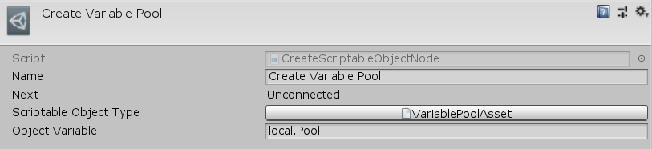

[#manual/create-scriptable-object-node]

## Create Scriptable Object Node

A Create Scriptable Object Node is an <<manual/instruction-graph-node.html,Instruction Graph Node>> that will create a new instance of a https://docs.unity3d.com/ScriptReference/ScriptableObject.html[ScriptableObject^] and store it in the given <<reference/variable-reference.html,VariableReference>>. Create a Create Scriptable Object Node in the menu:Create[Object Manipulation > Create Scriptable Object] menu of the Instruction Graph Window.

See <<topics/graphs/overview.html,Graphs>> for more information on instruction graphs. +

### Fields

[cols="1,2"]
|===
| Name	| Description

| Scriptable Object Type	| The type of the https://docs.unity3d.com/ScriptReference/ScriptableObject.html[ScriptableObject^] to create
| Object Variable	| The <<reference/variable-reference.html,VariableReference>> to store the created object in
|===

ifdef::backend-multipage_html5[]
<<reference/create-scriptable-object-node.html,Reference>>
endif::[]
