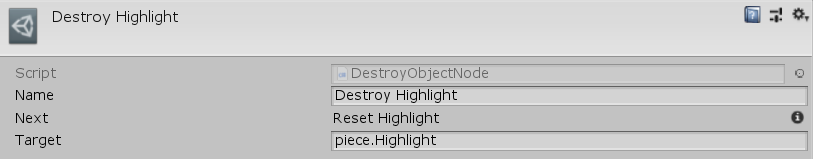

[#manual/destroy-object-node]

## Destroy Object Node

A Destroy Object Node is an <<manual/instruction-graph-node.html,Instruction Graph Node>> that will destroy any https://docs.unity3d.com/ScriptReference/Object.html[Object^] that has been previously created, either by a <<manual/create-game-object-node.html,Create Game Object Node>>, a <<manual/create-scriptable-object-node,Create Scriptable Object Node>>, or that is loaded in a scene. Create a Destroy Object Node in the menu:Create[Object Manipulation > Destroy Object] menu of the Instruction Graph Window.

See <<topics/graphs/overview.html,Graphs>> for more information on instruction graphs. +
See the "Destroy Highlight" node on the "BoardTakeTurn" <<manual/instruction-graph,Instruction Graph>> in the BoardGame project for an example usage.

### Fields

[cols="1,2"]
|===
| Name	| Description

| Target	| The <<reference/variable-reference.html,VariableReference>> to the object to be destroyed
|===

ifdef::backend-multipage_html5[]
<<reference/destroy-object-node.html,Reference>>
endif::[]