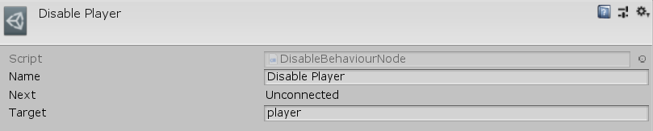

[#manual/disable-behaviour-node]

## Disable Behaviour Node

A Disable Behaviour Node is an <<manual/instruction-graph-node.html,Instruction Graph Node>> that will disable a https://docs.unity3d.com/ScriptReference/Behaviour.html[Behaviour^] on the given https://docs.unity3d.com/ScriptReference/GameObject.html[GameObject^]. Create a Disable Behaviour Node in the menu:Create[Object Manipulation > Disable Behaviour] menu of the Instruction Graph Window.

See the "Disable Player" node on the "MazeStart" <<manual/instruction-graph,Instruction Graph>> in the Maze project for an example usage.

### Fields

[cols="1,2"]
|===
| Name	| Description

| Target	| The <<reference/variable-reference.html,VariableReference>> to the https://docs.unity3d.com/ScriptReference/Behaviour.html[Behaviour^] to disable
|===

ifdef::backend-multipage_html5[]
<<reference/disable-behaviour-node.html,Reference>>
endif::[]