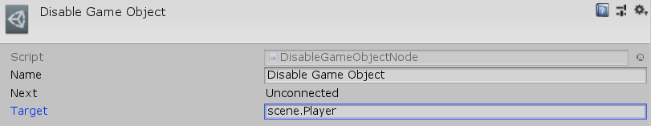

[#manual/disable-game-object-node]

## Disable Game Object Node

A Disable Game Object Node is an <<manual/instruction-graph-node.html,Instruction Graph Node>> that will deactivate a https://docs.unity3d.com/ScriptReference/GameObject.html[GameObject^]. Create a Disable Game Object Node in the menu:Create[Object Manipulation > Deactivate Game Object] menu of the Instruction Graph Window.

See <<topics/graphs-1.html,Graphs>> for more information on instruction graphs. +

### Fields

[cols="1,2"]
|===
| Name	| Description

| Target	| The <<reference/variable-reference.html,VariableReference>> to the https://docs.unity3d.com/ScriptReference/GameObject.html[GameObject^] to deactivate
|===

ifdef::backend-multipage_html5[]
<<reference/disable-game-object-node.html,Reference>>
endif::[]