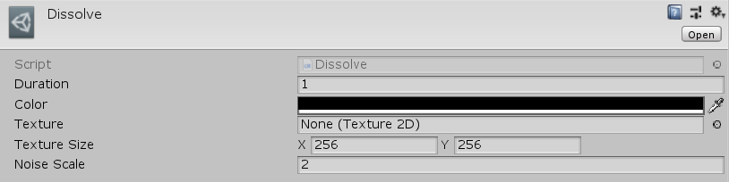

[#manual/dissolve-transition]

## Dissolve Transition

Dissolve is an implementation of a <<manual/cutoff-transition.html,Cutoff Transition>> <<manual/transition.html,Transition>> that will fade the screen based on an input https://docs.unity3d.com/ScriptReference/Texture.html[Texture^] over the duration of the <<manual/transition.html,Transition>>. The blue component of the texture will be read as the value of the cutoff. Higher values will take longer to dissolve - values of 0 will be _Color_ right from the beginning of the <<manual/transition.html,Transition>>, and values of 255 will not dissolve to _Color_ until the end of the <<manual/transition.html,Transition>>. If _Texture_ is null, a https://docs.unity3d.com/ScriptReference/Texture.html[Texture^] will automatically be generated with perlin noise to create a smooth looking transition. Create a Dissolve through the menu:Create[PiRho Soft > Transitions > Dissolve] menu in the project view.

### Fields

[cols="1,2"]
|===
| Name	| Description

| Color	| The https://docs.unity3d.com/ScriptReference/Color.html[Color^] of the screen to dissolve to
| Texture	| The input https://docs.unity3d.com/ScriptReference/Texture.html[Texture^] that gives the pattern of the dissolve
| Texture Size	| If _Texture_ is null, the size of the https://docs.unity3d.com/ScriptReference/Texture.html[Texture^] to generate
| Noise Scale	| If _Texture_ is null, the scale value of the perlin noise generated as the input https://docs.unity3d.com/ScriptReference/Texture.html[Texture^]
|===

ifdef::backend-multipage_html5[]
<<reference/dissolve-transition.html,Reference>>
endif::[]