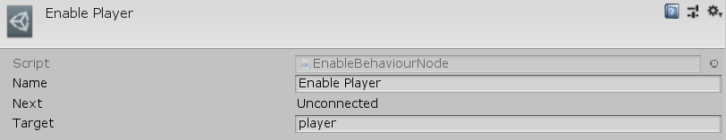

[#manual/enable-behaviour-node]

## Enable Behaviour Node

An Enable Behaviour Node is an <<manual/instruction-graph-node.html,Instruction Graph Node>> that will enable a https://docs.unity3d.com/ScriptReference/Behaviour.html[Behaviour^] on the given https://docs.unity3d.com/ScriptReference/GameObject.html[GameObject^]. Create an Enable Behaviour Node in the menu:Create[Object Manipulation > Enable Behaviour] menu of the Instruction Graph Window.

See <<topics/graphs-1.html,Graphs>> for more information on instruction graphs. +
See the "Enable Player" node on the "MazeStart" <<manual/instruction-graph,Instruction Graph>> in the Maze project for an example usage.

### Fields

[cols="1,2"]
|===
| Name	| Description

| Target	| The <<reference/variable-reference.html,VariableReference>> to the https://docs.unity3d.com/ScriptReference/Behaviour.html[Behaviour^] to enable
|===

ifdef::backend-multipage_html5[]
<<reference/enable-behaviour-node.html,Reference>>
endif::[]