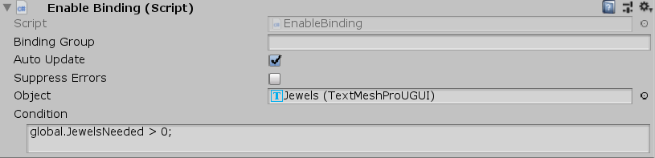

[#manual/enable-binding]

## Enable Binding

Enable Binding is a <<manual/variable-binding.html,Variable Binding>> that will enable or disable an https://docs.unity3d.com/ScriptReference/Object.html[Object^] based on the evaluation of an <<reference/expression.html,Expression>>. _Object_ must be a https://docs.unity3d.com/ScriptReference/GameObject.html[GameObject^], https://docs.unity3d.com/ScriptReference/Behaviour.html[Behaviour^], or https://docs.unity3d.com/ScriptReference/Renderer.html[Renderer^] as these are the only https://docs.unity3d.com/ScriptReference/Object.html[Object^], types that Unity allows to be enabled and disabled. If _Condition_ is invalid or does not return a bool, then the object will be disabled.

NOTE: If _Object_ is set to this binding or the https://docs.unity3d.com/ScriptReference/GameObject.html[GameObject^] that has this binding, then the _AutoUpdate_ flag will not function as this binding will not receive `UpdateBinding()` calls from the <<manual/composition-manager.html,Composition Manager>>

See the _"MazeUi"_ scene in the Maze project for an example usage.

### Fields

[cols="1,2"]
|===
| Name	| Description

| Object	| The https://docs.unity3d.com/ScriptReference/GameObject.html[GameObject^], https://docs.unity3d.com/ScriptReference/Behaviour.html[Behaviour^], or https://docs.unity3d.com/ScriptReference/Renderer.html[Renderer^] to enable or disable based on _Condition_
| Condition	| The <<reference/expression.html,Expression>> that determines whether _Object_ will be enabled or disabled
|===

ifdef::backend-multipage_html5[]
<<reference/enable-binding.html,Reference>>
endif::[]