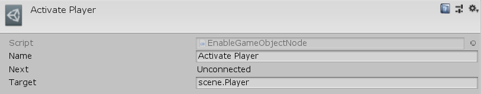

[#manual/enable-game-object-node]

## Enable Game Object Node

An Enable Game Object Node is an <<manual/instruction-graph-node.html,Instruction Graph Node>> that will activate a https://docs.unity3d.com/ScriptReference/GameObject.html[GameObject^]. Create an Enable Game Object Node in the menu:Create[Object Manipulation > Activate Game Object] menu of the Instruction Graph Window.

### Fields

[cols="1,2"]
|===
| Name	| Description

| Target	| The <<reference/variable-reference.html,VariableReference>> to the https://docs.unity3d.com/ScriptReference/GameObject.html[GameObject^] to activate
|===

ifdef::backend-multipage_html5[]
<<reference/enable-game-object-node.html,Reference>>
endif::[]