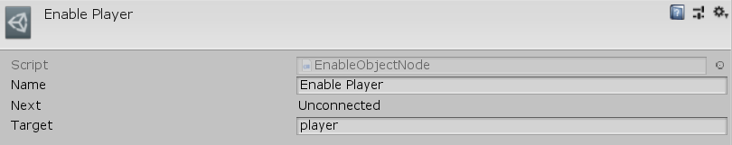

[#manual/enable-object-node]

## Enable Object Node

An Enable Object Node is an <<manual/instruction-graph-node.html,Instruction Graph Node>> that will enable the given https://docs.unity3d.com/ScriptReference/Object.html[Object^], _Target_. Create an Enable Object Node in the menu:Create[Object Manipulation > Disable Object] menu of the Instruction Graph Window.

NOTE: _Target_ must be a https://docs.unity3d.com/ScriptReference/GameObject.html[GameObject^], https://docs.unity3d.com/ScriptReference/Behaviour.html[Behaviour^], or https://docs.unity3d.com/ScriptReference/Renderer.html[Renderer^] as these are the only https://docs.unity3d.com/ScriptReference/Object.html[Object^], types that Unity allows to be enabled and disabled.

See <<topics/graphs-1.html,Graphs>> for more information on instruction graphs. +
See the "Enable Player" node on the "MazeStart" <<manual/instruction-graph,Instruction Graph>> in the Maze project for an example usage.

### Fields

[cols="1,2"]
|===
| Name	| Description

| Target	| A <<reference/variable-reference.html,VariableReference>> to the https://docs.unity3d.com/ScriptReference/Object.html[Object^] to enable
|===

ifdef::backend-multipage_html5[]
<<reference/enable-object-node.html,Reference>>
endif::[]