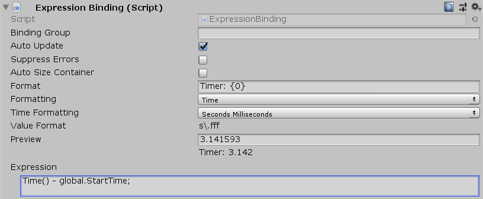

[#manual/expression-binding]

## Expression Binding

Expression Binding is a <<manual/variable-binding.html,Variable Binding>> that will run an <<reference/expression,Expression>> and display its output on a sibling http://digitalnativestudios.com/textmeshpro/docs/[TextMeshPro] component. If _Expression_ evaluates to a float or an int, then customized <<reference/binding-formatter.html,Formatting>> can be applied. If _Expression_ is invalid, then the text will be disabled.

See the _"MazeUi"_ scene in the Maze project for an example usage.

### Fields

[cols="1,2"]
|===
| Name	| Description

| Formatting	| The <<reference/binding-formatter.html,Formatting>> settings for the text if _Expression_ is an int or a float
| Expression	| The <<reference/expression,Expression>> to evaluate to determine the text
|===

ifdef::backend-multipage_html5[]
<<reference/expression-binding.html,Reference>>
endif::[]