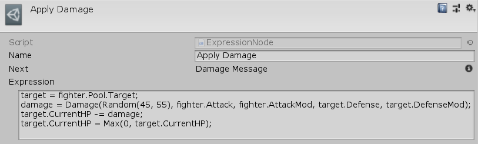

[#manual/expression-node]

## Expression Node

An Expression Node is an <<manual/instruction-graph-node.html,Instruction Graph Node>> that runs an <<reference/expression.html,Expression>>. Create an Expression Node in the menu:Create[Composition > Expression] menu of the Instruction Graph Window.

See <<topics/graphs-1.html,Graphs>> for more information on instruction graphs. +
See <<topics/variables-5.html,Expressions>> for more information. +
See the _"Apply Damage"_ node in "BattleScratch" <<instruction-graph.html,Instruction Graph>> in the Battle project for an example usage.

### Fields

[cols="1,2"]
|===
| Name	| Description

| Expression	| The <<reference/expression.html,Expression>> to run
|===

ifdef::backend-multipage_html5[]
<<reference/expression-node.html,Reference>>
endif::[]