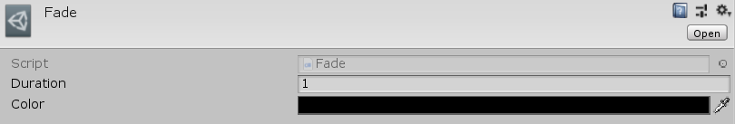

[#manual/fade]

## Fade

Fade is an implementation of a <<manual/cutoff.html,Cutoff>> <<manual/transition.html,Transition>> that will fade the screen to a static https://docs.unity3d.com/ScriptReference/Color.html[Color^] over the duration of the <<manual/transition.html,Transition>>. Create a Fade through the menu:Create[PiRho Soft > Transitions > Fade] menu in the project view.

### Fields

[cols="1,2"]
|===
| Name	| Description

| Color	| The https://docs.unity3d.com/ScriptReference/Color.html[Color^] to fade to
|===

ifdef::backend-multipage_html5[]
<<reference/fade.html,Reference>>
endif::[]