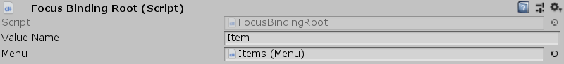

[#manual/focus-binding-root]

## Focus Binding Root

Focus Binding Root is a <<manual/binding-root.html,Binding Root>> that references a <<manual/menu.html,Menu>> in the scene and uses that <<manual/menu.html,Menu's>> currently focused <<manual/menu-item.html,Menu Item>> as the binding variables for the child <<manual/variable-binding.html,Variable Bindings>>.

See <<topics/bindings-2.html,Binding Roots>> for more information on binding roots. +
See the _"Description"_ object in the _"Shop"_ scene of the Shop project for an example usage.

### Fields

[cols="1,2"]
|===
| Name	| Description

| Menu	| The <<manual/menu.html,Menu>> whose focused item to use for binding variables
|===

ifdef::backend-multipage_html5[]
<<reference/focus-binding-root.html,Reference>>
endif::[]