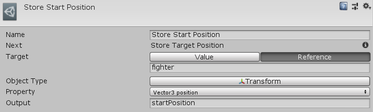

[#manual/get-property-node]

## Get Property Node

A Get Property Node is an <<manual/instruction-graph-node.html,Instruction Graph Node>> that can retrieve and store any property or field on any https://docs.unity3d.com/ScriptReference/Object.html[Object^] provided that the type of the property or field can be stored in a <<reference/variable-value.html,VariableValue>>. Create a Get Property Node in the menu:Create[Composition > Get Property] menu of the Instruction Graph Window.

See the _"Store Start Position"_ node on the _"Battle Scratch"_ <<manual/instruction-graph.html,Instruction Graph>> in the Battle project for an example usage.

### Fields

[cols="1,2"]
|===
| Name	| Description

| Target	| The <<reference/object-variable-source.html,VariableSource>> to the object to get the value from
| Object Type	| The type of the https://docs.unity3d.com/ScriptReference/Object.html[Object^] to get the value from
| Property	| The property to get
| Output	| The <<reference/variable-reference.html,VariableReference>> to store the value in
|===

ifdef::backend-multipage_html5[]
<<reference/get-property-node.html,Reference>>
endif::[]