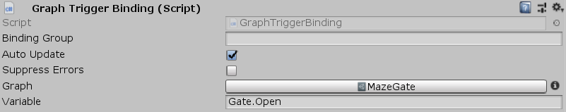

[#manual/graph-trigger-binding]

## Graph Trigger Binding

Graph Trigger Binding is a <<manual/variable-binding.html,Variable Binding>> that runs an <<manual/instruction-graph.html,Instruction Graph>> when a given <<reference/variable-reference.html,VariablesReference>> changes. _Graph_ will always run the first time `UpdateBindings()` is called and it will not run again if it is already running.

See the _"Maze3"_ scene in the Maze project for an example usage.

### Fields

[cols="1,2"]
|===
| Name	| Description

| Graph	| The <<manual/instruction-graph.html,Instruction Graph>> to run when _Variable_ changes
| Variable	| The <<reference/variable-reference.html,VariablesReference>> to watch for changes in
|===

ifdef::backend-multipage_html5[]
<<reference/graph-trigger-binding.html,Reference>>
endif::[]