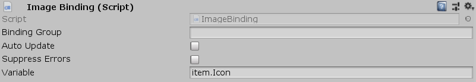

[#manual/image-binding]

## Image Binding

Image Binding is a <<manual/variable-binding.html,Variable Binding>> that will set the https://docs.unity3d.com/ScriptReference/Sprite.html[Sprite^] of a sibling https://docs.unity3d.com/ScriptReference/UI.Image.html[Image^] based on the given <<reference/variable-reference.html,VariableReference>>. If _Variable_ is invalid, then the image will be disabled.

See <<topics/bindings/variable-bindings.html,Variable Bindings>> for more information. +
See the _"LootItemDisplay"_ prefab in the Loot project for an example usage.

### Fields

[cols="1,2"]
|===
| Name	| Description

| Variable	| A <<reference/variable-reference.html,VariableReference>> to the https://docs.unity3d.com/ScriptReference/Sprite.html[Sprite^] to display
|===

ifdef::backend-multipage_html5[]
<<reference/image-binding.html,Reference>>
endif::[]