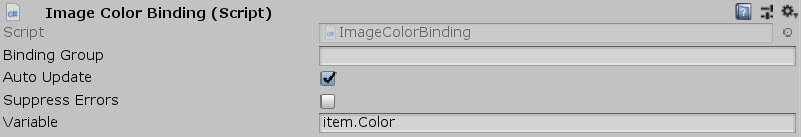

[#manual/image-color-binding]

## Image Color Binding

Image Color Binding is a <<manual/variable-binding.html,Variable Binding>> that will set the blend color of a sibling https://docs.unity3d.com/ScriptReference/UI.Image.html[Image^] based on the given <<reference/variable-reference.html,VariableReference>>. If _Variable_ is invalid, then the image will be disabled.

See <<topics/bindings-3.html,Variable Bindings>> for more information. +

### Fields

[cols="1,2"]
|===
| Name	| Description

| Variable	| A <<reference/variable-reference.html,VariableReference>> to the https://docs.unity3d.com/ScriptReference/Color.html[Color^] to use as the blend color
|===

ifdef::backend-multipage_html5[]
<<reference/image-color-binding.html,Reference>>
endif::[]