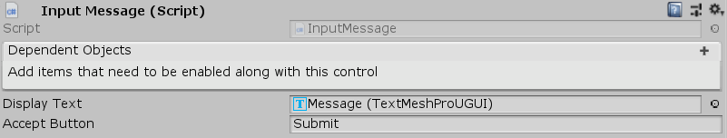

[#manual/input-message]

## Input Message

Input Message is an implementation of <<manual/message-control.html,Message Control>> that waits for an input before finishing.

See the _"MazeUI"_ scene in the Maze project for an example usage.

### Fields

[cols="1,2"]
|===
| Name	| Description

| Accept Button	| The string name of the button to wait to be pressed
|===

ifdef::backend-multipage_html5[]
<<reference/input-message.html,Reference>>
endif::[]