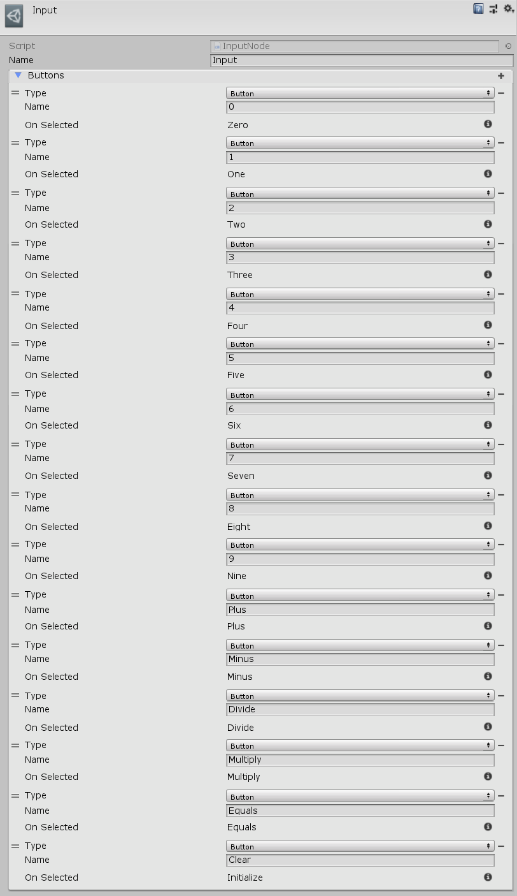

[#manual/input-node]

## Input Node

An Input Node is an <<manual/instruction-graph-node.html,Instruction Graph Node>> that will wait to continue to the next node until an input is received. Any number of buttons, keys, or axes can be added to listen for input from, each specifying their own node to branch to. Each input specifies whether it is an `Axis`, `Button`, or `Key`. An `Axis` specifies the value that input axis must reach before triggering. Create a Branch Node in the menu:Create[Interface > Input] menu of the Instruction Graph Window.

See <<topics/graphs-1.html,Graphs>> for more information on instruction graphs. +
See the _"Calculator"_ <<manual/instruction-graph.html,Instruction Graph>> in the Calculator project for an example usage.

### Fields

[cols="1,2"]
|===
| Name	| Description

| Buttons	| The list of button infos to listen for
| Type	| The <<reference/input-node-button-type.html,ButtonType>> to listen for - `Axis`, `Button`, or `Key`
| Name	| If `Axis` or `Button`, the name of the correstponding input to listen for
| Value	| If `Axis`, the magintude the axis must reach before being triggered
| Key	| If `Key`, the https://docs.unity3d.com/ScriptReference/KeyCode.html[KeyCode^] to listen for
|===

ifdef::backend-multipage_html5[]
<<reference/input-node.html,Reference>>
endif::[]