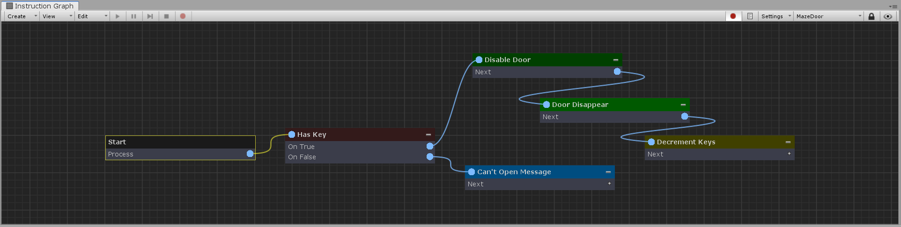

[#manual/instruction-graph]

## Instruction Graph

An abstract https://docs.unity3d.com/ScriptReference/ScriptableObject.html[Asset^] that is the main component of the composition system. Create graphs and use the Instruction Graph Window to build <<manual/instruction-graph-node.html,Nodes>> that execute actions, and create connections to traverse through each node sequentially, similar to a flow chart. An Instruction Graph can have Input <<reference/variable-value.html,Values>> that are passed in from the calling object and Output <<reference/variable-value.html,Values>> that it returns to the calling object. All graphs have a _Context_ <<reference/variable-value.html>> which is usually set to the object that originally ran the graph. Edit the definitions for the <<reference/variable-definition.html,Definitions>> for the _Context_, _Inputs_, and _Outputs_ in the inspector for an Instruction Graph, and each of them will automatically be cast to the correct type in script. Built in Instruction Graph types are the <<manual/simple-graph,Simple Graph>>, <<manual/scoped-graph,Scoped Graph>>, and the <<manual/mockup-graph,Mockup Graph>> (used for prototyping).

See <<topics/graphs/overview.html,Graphs>> for more information. +

### Fields

image::instruction-graph.png[Instruction Graph]

[cols="1,2"]
|===
| Name	| Description

| Context Name	| The string name of the context <<reference/variable-value.html,Value>> to be accessed in <<reference/expression.html,Expressions>> and <<reference/variable-reference.html,VariableReferences>>
| Context Definition	| The <<reference/variable-definition.html,VariableDefinition>> to cast the context <<reference/variable-value.html,Value>> to when the Instruction is run
| Inputs	| The list of <<reference/variable-definition.html,VariableDefinitions>> that describes the inputs into the Instruction
| Outputs	| The list of <<reference/variable-definition.html,VariableDefinitions>> that describes the outputs from the Instruction
|===

ifdef::backend-multipage_html5[]
<<reference/instruction-graph.html,Reference>>
endif::[]