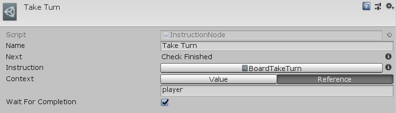

[#manual/instruction-node]

## Instruction Node

An Instruction Node is an <<manual/instruction-graph-node.html,Instruction Graph Node>> that executes a different <<manual/instruction-graph.html,Instruction Graph>>. Intruction Nodes can pass in a new _Context_ object to _Instruction_ and optionally _WaitForCompletion_ of the called <<manual/instruction-graph.html,Instruction Graph>> before moving on to the next node. Create an Instruction Node in the menu:Create[Composition > Instruction] menu of the Instruction Graph Window.

See the _"Take Turn"_ node on the "BoardLoop" <<instruction-graph.html,Instruction Graph>> in the BoardGame project for an example usage.

### Fields

[cols="1,2"]
|===
| Name	| Description

| Instruction	| The <<manual/instruction-graph,Instruction Graph>> to execute
| Context	| A <<reference/variable-value-source.html,VariableValueSource>> to the context object to be passed to _Instruction_
| Wait For Completion	| Whether to wait until _Instruction_ is finished running before moving on to the next node
|===

ifdef::backend-multipage_html5[]
<<reference/instruction-node.html,Reference>>
endif::[]