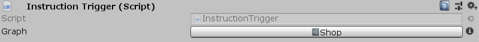

[#manual/instruction-trigger]

## Instruction Trigger

Instruction Trigger is a https://docs.unity3d.com/ScriptReference/MonoBehaviour.html[MonoBehaviour^] that stores an <<manual/instruction-graph.html,Instruction Graph>> for derived classes or other objects to run manually. Instruction Trigger itself will never trigger _Graph_ on its own, only from derived classes when their desired conditions are met and the `Run()` method is called. Provided implementations of the Instruction Trigger are <<manual/start-graph-trigger.html,Start Graph Trigger>>, <<manual/enable-graph-trigger.html,Enable Graph Trigger>>, <<manual/click-graph-trigger.html,Click Graph Trigger>>, and <<manual/button-graph-trigger.html,Button Graph Trigger>>.

See <<topics/graphs/overview.html,Graphs>> for more information on instruction graphs. +
See the _"Shop"_ scene and the _"Player"_ script in the Shop project for an example usage.

### Fields

[cols="1,2"]
|===
| Name	| Description

| Graph	| The <<manual/instruction-graph.html,Instruction Graph>> to run for this Instruction Trigger
|===

ifdef::backend-multipage_html5[]
<<reference/instruction-trigger.html,Reference>>
endif::[]