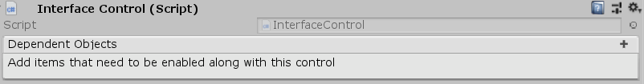

[#manual/interface-control]

## Interface Control

Interface Control is a https://docs.unity3d.com/ScriptReference/MonoBehaviour.html[MonoBehaviour^] to be attached to UI objects so that they be manually shown and hidden with the <<manual/show-control-node.html,Show Control Node>> and the <<manual/hide-control-node.html,Hide Control Node>>. When loaded an Interface Control always starts inactive until `Activate()` is called. In addition, an Interface Control can maintain a list of https://docs.unity3d.com/ScriptReference/GameObject.html[GameObjects^] that are activated and deactivated along with this control.

See the _"Timer"_ object in the _"MazeUI"_ scene in the Maze project for an example usage.

### Fields

[cols="1,2"]
|===
| Name	| Description

| Dependent Objects	| The list of https://docs.unity3d.com/ScriptReference/GameObject.html[GameObjects^] activated and deactivated along with this control
|===

ifdef::backend-multipage_html5[]
<<reference/interface-control.html,Reference>>
endif::[]