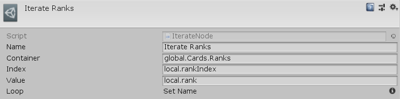

[#manual/iterate-node]

## Iterate Node

An Iterate Node is an <<manual/instruction-graph-node.html,Instruction Graph Node>> that implements <<reference/i-loop-node.html,ILoopNode>>. It repeatedly runs the next nodes in the graph for each item in the <<reference/variable-reference.html,VariableReference>>, _Container_. _Container_ can store either an <<reference/i-variable-store.html,IVariableStore>>, or an <<reference/i-variable-list.html,IVariableList>>. Each iteration through the loop will store the index of the item in the <<reference/variable-reference.html,VariableReference>>, _Index_, and the value of the item in the <<reference/variable-reference.html,VariableReference>>, _Value_. Create an Iterate Node in the menu:Create[Control Flow > Iterate] menu of the Instruction Graph Window.

See the _"Iterate Ranks"_ node on the _"Load Game"_ <<manual/instruction-graph.html,Instruction Graph>> in the CardGame project for an example usage.

### Fields

[cols="1,2"]
|===
| Name	| Description

| Container	| A <<reference/variable-reference.html,VariableReference>> to the <<reference/i-variable-store.html,IVariableStore>> or <<reference/i-variable-list.html,IVariableList>> to be iterated
| Index	| A <<reference/variable-reference.html,VariableReference>> to store the index of the item being iterated over
| Value	| A <<reference/variable-reference.html,VariableReference>> to store the value of the item being iterated over
|===

ifdef::backend-multipage_html5[]
<<reference/iterate-node.html,Reference>>
endif::[]