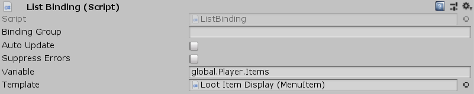

[#manual/list-binding]

## List Binding

List Binding is a <<manual/variable-binding.html,Variable Binding>> that will create child https://docs.unity3d.com/ScriptReference/GameObject.html[GameObjects^] based on _Template_ for each <<manual/variable-value.html,Value>> in the <<manual/variable-reference.html,VariableReference>>, _Variable_. _Variable_ must store either an <<reference/i-variable-store.html,IVariableStore>>, or an <<reference/i-variable-list.html,IVariableList>>. Each _Template_ item is instantiated as a <<manual/binding-root.html,Binding Root>> with its _Value_ set to the corresponding item in the store or list. A List Binding is best used in conjunction with a <<manual/menu.html,Menu>> to populate it with <<manual/menu-item.html,Menu Items>>.

See the _"ItemsMenu"_ and _"EquipmentMenu"_ objects in the _"Loot Menu"_ scene of the Loot project for an example usage.

### Fields

[cols="1,2"]
|===
| Name	| Description

| Variable	| A <<manual/variable-reference.html,VariableReference>> to the <<reference/i-variable-store.html,IVariableStore>> or <<reference/i-variable-list.html,IVariableList>> that child objects should be created for
| Template	| The prefab (must contain a <<manual/binding-root.html,Binding Root>>) to use for instantiated child objects
|===

ifdef::backend-multipage_html5[]
<<reference/list-binding.html,Reference>>
endif::[]