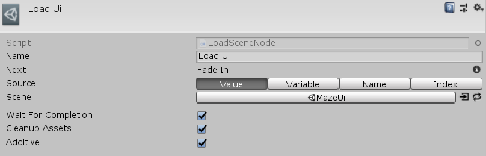

[#manual/load-scene-node]

## Load Scene Node

A Load Scene Node is an <<manual/instruction-graph-node.html,Instruction Graph Node>> that will load a new https://docs.unity3d.com/ScriptReference/SceneManagement.Scene.html[Scene^]. The scene to be loaded can based on a <<reference/scene-reference.html,SceneReference>>, string name, build index, or a <<reference/variable-reference.html,VariableReference>> to a string name or build index. If _WaitForCompletion_ is specified, the graph will not move to the next node until the scene has fully completed loading. Create a Load Scene Node in the menu:Create[Sequencing > Load Scene] menu of the Instruction Graph Window.

See <<topics/graphs-1.html,Graphs>> for more information on instruction graphs. +
See the _"Load UI"_ node on the _"MazeStart"_ <<manual/instruction-graph.html,Instruction Graph>> in the Maze project for an example usage.

### Fields

[cols="1,2"]
|===
| Name	| Description

| Source	| The <<referenece/load-scene-node-scene-source,SourceType>> to load the scene based off of
| Scene	| If `Value`, the <<reference/scene-reference.html,SceneReference>> to load
| Scene Variable	| If `Variable`, the <<reference/variable-reference.html,VariableReference>> to a string name or build index of the sceen to load
| Scene Name	| If `Name`, the string name of the scene to load
| Scene Index	| If `Index`, the build index of the scene to load
| Wait For Completion	| Whether to wait until the scene has completed loading before moving to the next node
| Cleanup Assets	| Whether to call https://docs.unity3d.com/ScriptReference/Resources.UnloadUnusedAssets.html[UnloadUnusedAssets()^] after the new scene is loaded
| Additive	| Whether to load the scene as https://docs.unity3d.com/ScriptReference/SceneManagement.LoadSceneMode.Additive.html[Additive^] or https://docs.unity3d.com/ScriptReference/SceneManagement.LoadSceneMode.Single.html[Single]
|===

ifdef::backend-multipage_html5[]
<<reference/load-scene-node.html,Reference>>
endif::[]