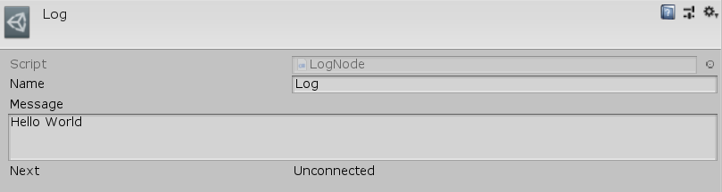

[#manual/log-node]

## Log Node

A Log Node is an <<manua/instruction-graph-node.html,Instruction Graph Node>> that is used for debugging purposes. It logs a <<reference/message.html,Message>> when the node is executed. Create a Log Node in the menu:Create[Debug > Log] menu of the Instruction Graph Window.

### Fields

[cols="1,2"]
|===
| Name	| Description

| Message	| The <<reference/message.html,Message>>
|===

ifdef::backend-multipage_html5[]
<<reference/log-node.html,Reference>>
endif::[]