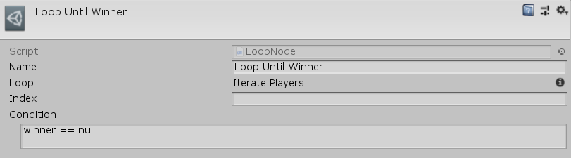

[#manual/loop-node]

## Loop Node

An Iterate Node is an <<manual/instruction-graph-node.html,Instruction Graph Node>> that implements <<reference/i-loop-node.html,ILoopNode>>. It repeatedly runs the next nodes in the graph until the evaluation of the <<reference/expression.html,Expression>>, _Condition_ is `false`. Each iteration through the loop will store the index of the item in the <<reference/variable-reference.html,VariableReference>>, _Index_. It can be thought of like `while` loop in scrpt. Create an Iterate Node in the menu:Create[Control Flow > Iterate] menu of the Instruction Graph Window.

See the _"Loop Until Winner"_ node on the _"BoardLoop"_ <<manual/instruction-graph.html,Instruction Graph>> in the BoardGame project for an example usage.

### Fields

[cols="1,2"]
|===
| Name	| Description

| Index	|  A <<reference/variable-reference.html,VariableReference>> to store the number of times the loop has run
| Condition	|  The <<reference/expression.html,Expression>> to evaluate to determine if the loop should continue
|===

ifdef::backend-multipage_html5[]
<<reference/loop-node.html,Reference>>
endif::[]