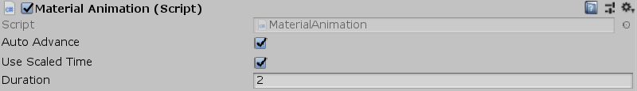

[#manual/material-animation]

## Material Animation

Material Animation is a https://docs.unity3d.com/ScriptReference/MonoBehaviour.html[MonoBehaviour^] that will animate a float property named _"_Progress"_ on the https://docs.unity3d.com/ScriptReference/Material.html[Material^] of a sibling https://docs.unity3d.com/ScriptReference/Renderer.html[Renderer^] from 0 to 1. If _AutoAdvance_ is set then when the behaviour is enabled, the _"_Progress"_ property of the https://docs.unity3d.com/ScriptReference/Material.html[Material^] will increment every frame over the time, _Duration_. If _AutoAdvance_ is not set then _Progress_ can manually be set either from script or through an https://docs.unity3d.com/ScriptReference/AnimationClip.html[AnimationClip^] and the https://docs.unity3d.com/ScriptReference/Material.html[Material^] will automatically be updated.

NOTE: The https://docs.unity3d.com/ScriptReference/Shader.html[Shader^] must have a float property named _"_Progress"_

See the _"Scratch"_ prefab in the Battle project for an example usage.

### Fields

[cols="1,2"]
|===
| Name	| Description

| Auto Advance	| Whether to automatically start the animation when the behaviour becomes enabled
| Progress	| If _AutoAdvance_ is `false`, the value to set the _"_Progress"_ property on the https://docs.unity3d.com/ScriptReference/Material.html[Material^] to
| Use Scaled Time	| If _AutoAdvance_ is `true`, whether to use https://docs.unity3d.com/ScriptReference/Time-deltaTime.html[DeltaTime^] or https://docs.unity3d.com/ScriptReference/Time-unscaledDeltaTime.html[UnscaledDeltaTime^] to advance _Progress_
| Duration	| If _AutoAdvance_ is `true`, the amount of time (in seconds) the animation will take to occur
|===

ifdef::backend-multipage_html5[]
<<reference/material-animation.html,Reference>>
endif::[]