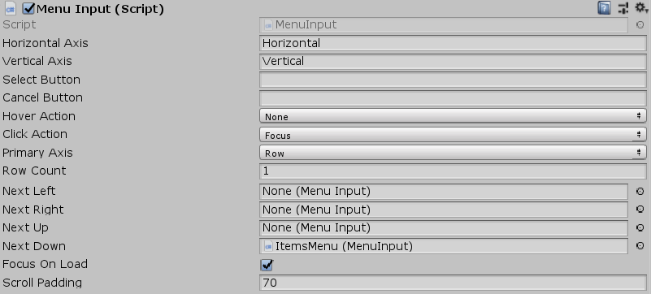

[#manual/menu-input]

## Menu Input

Menu Input is a https://docs.unity3d.com/ScriptReference/MonoBehaviour.html[MonoBehaviour^] that should be attached as a sibling of a <<manual/menu.html,Menu>> to handle the behaviour of input, focusing, selecting, and scrolling, through <<manual/menu-item.html,Menu Items>>.

See the _"EquimentMenu"_ and _"ItemsMenu"_ objects in the _"Loot Menu"_ scene of the Loot project for an example usage.

### Fields

[cols="1,2"]
|===
| Name	| Description

| Horizontal Axis	| The name of the input axis to use for horizontal movement
| Vertical Axis	| The name of the input axis to use for vertical movement
| Select Button	| The input button to use to select the currently focused <<manual/menu-item.hmtl,Menu Item>>
| Cancel Button	| The input button to use to cancel the <<manual/menu.html,Menu>> or <<manual/selection-control.html,Selection>>
| Hover Action	| The <<reference/menu-input-pointer-action.html,Action>> to take when a <<manual/menu-item.html,Menu Item>> is hovered over
| Click Action	| The <<reference/menu-input-pointer-action.html,Action>> to take when a <<manual/menu-item.html,Menu Item>> is clicked on
| Primary Axis	| Whether the <<manual/menu-item.html,Menu Items>> are arranged by `Row` or by `Column`
| Row Count	| The number of rows in the menu
| Column Count	| The number of columns in the menu
| Next Left	| The menu to transfer input to when moving past the left side of this menu
| Next Right	| The menu to transfer input to when moving past the right side of this menu
| Next Up	| The menu to transfer input to when moving past the top of this menu
| Next Down	| The menu to transfer input to when moving past the bottom of this menu
| Focus On Load	| Whether to enable input for this menu when it first loads
| Scroll Padding	| The distance between the edge of the scroll viewport and the <<manual/menu-item,Menu Item>> when focusing on a new a new item
|===

ifdef::backend-multipage_html5[]
<<reference/menu-input.html,Reference>>
endif::[]