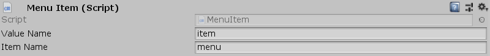

[#manual/menu-item]

## Menu Item

Menu Item is a <<manual/binding-root.html,Binding Root>> that is used for objects that can be selected as part of a <<manual/menu.html,Menu>>. In addition to the <<manual/binding-root.html,Binding Root's>> _ValueName_ field which exposes the <<reference/variable-value.html,Value>> that the Menu Item was created from, it exposes the _ItemName_ field which gives access to the data of the Menu Item itself. <<reference/variable-value.html,Value's>> that can be accessed by child <<manual/variable-binding.html,Variable Bindings>> through _ItemName_ are _Index_, _Column_, _Row_, _Label_, and _Focused_.

See <<topics/bindings-1.html,Bindings>> for more information on variable bindings. +
See the _"Loot Item Display"_ prefab in the Loot project for an example usage.

### Fields

[cols="1,2"]
|===
| Name	| Description

| Item Name	| The string name used to access this Menu Item's properties by child <<manual/variable-binding.html,Variable Bindings>>
| Index	| The index of this Menu Item in the menu
| Column	| The column this Menu Item occupies in its menu
| Row	| The row this Menu Item occupies in its menu
| Label	| The string name used to identify the Menu Item
| Focused	| Whether this Menu Item is currently focused
|===

ifdef::backend-multipage_html5[]
<<reference/menu-item.html,Reference>>
endif::[]