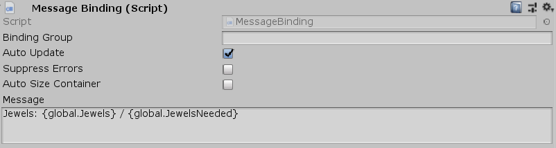

[#manual/message-binding]

## Message Binding

Message Binding is a <<manual/string-binding.html,String Binding>> that binding will display a <<reference/message.html,Message>> on a sibling http://digitalnativestudios.com/textmeshpro/docs/[TextMeshPro^] component, using the this binding's <<manual/binding-root.html,Binding Root>> as the variables to resolve the <<reference/message.html,Message>>.

See the <<topics/bindings-3.html,Variable Bindings>> topic for more information. +
See the <<topics/interface-3,Messages>> topic for more information. +
See the _"Timer"_ object in _"MazeUi"_ scene of the Maze project for an example usage.

### Fields

[cols="1,2"]
|===
| Name	| Description

| Message	| The <<referece/message.html,Message>> to display
|===

ifdef::backend-multipage_html5[]
<<reference/message-binding.html,Reference>>
endif::[]