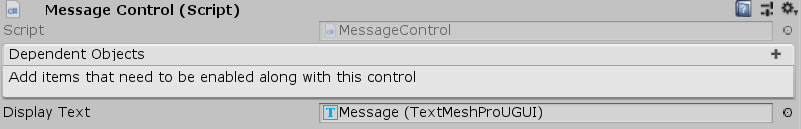

[#manual/message-control]

## Message Control

A Message Control is an <<manual/interface-control.html,Interface Control>> that shows a string of text on a http://digitalnativestudios.com/textmeshpro/docs/[TextMeshPro^] component when prompted. A Message Control is usually activated, shown, and deactivated by a <<manual/message-node.html,Message Node>>. Use a <<manual/message-input.html,Message Input>> behaviour to manually advance the text.

See the <<topics/interface/messages,Messages>> topic for more information. +
See the _"Message"_ object in the _"Board"_ scene of the BoardGame project for an example usage.

### Fields

[cols="1,2"]
|===
| Name	| Description

| Display Text	| The http://digitalnativestudios.com/textmeshpro/docs/[TextMeshPro^] component to display the <<reference/message.html,Message>> on
|===

ifdef::backend-multipage_html5[]
<<reference/message-control.html,Reference>>
endif::[]