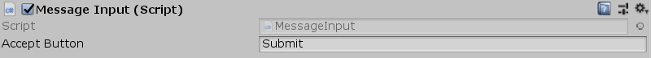

[#manual/message-input]

## Message Input

Message Input is a https://docs.unity3d.com/ScriptReference/MonoBehaviour.html[MonoBehaviour^] that should be attached as a sibling of a <<manual/message-control.html,Message Control>> to allow the user to advance the text with a <<reference/input-helper.html,button>> press.

See the <<topics/interface/messages,Messages>> topic for more information. +
See the _"MazeUi"_ scene of the Maze project for an example usage.

### Fields

[cols="1,2"]
|===
| Name	| Description

| Accept Button	| The <<reference/input-helper.html,input button>> that will advance the text of the <<manual/message-control,Message Control>>
|===

ifdef::backend-multipage_html5[]
<<reference/message-input.html,Reference>>
endif::[]