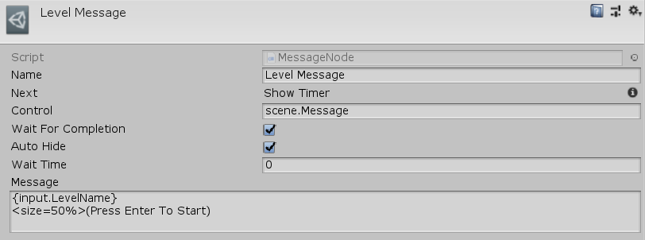

[#manual/message-node]

## Message Node

A Message Node is an <<manual/instruction-graph-node.html,Instruction Graph Node>> that will tell a <<manual/message-control.html,Message Control>> to show a <<reference/message.html,Message>>. Showing a <<reference/message.html,Message>> will automatically activate the <<manual/message-control.html,Message Control>> and will hide it when the <<reference/message.html,Message>> is complete if _AutoHide_ is `true`. If _AutoHide_ is `false` then a <<manual/hide-control-node.html,Hide Control Node>> must be used to deactivate it. Create a Message Node in the menu:Create[Interface > Message] menu of the Instruction Graph Window.

See the <<topics/graphs/overview.html,Graphs>> topic for more information on instruction graphs. +
See the <<topics/interface/messages,Messages>> topic for more information on messages. +
See the _"Shop"_ <<manual/instruction-graph.html,Instruction Graph>> in the Shop project for an example usage.

### Fields

[cols="1,2"]
|===
| Name	| Description

| Control	| A <<reference/variable-reference.html,VariableReference>> to the <<manual/message-control.html,Message Control>> that should display _Message_
| Wait For Completion	| Whether to wait for _Message_ to finish being displayed before moving on to the next node
| Auto Hide	| Whether to deactivate _Control_ when _Message_ is finished being displayed
| Wait Time	| If _AutoHide_ is `true`, the amount of time (in seconds) to wait before deactivating _Control_
| Message	| The <<reference/message.html,Message>> to display
|===

ifdef::backend-multipage_html5[]
<<reference/message-node.html,Reference>>
endif::[]