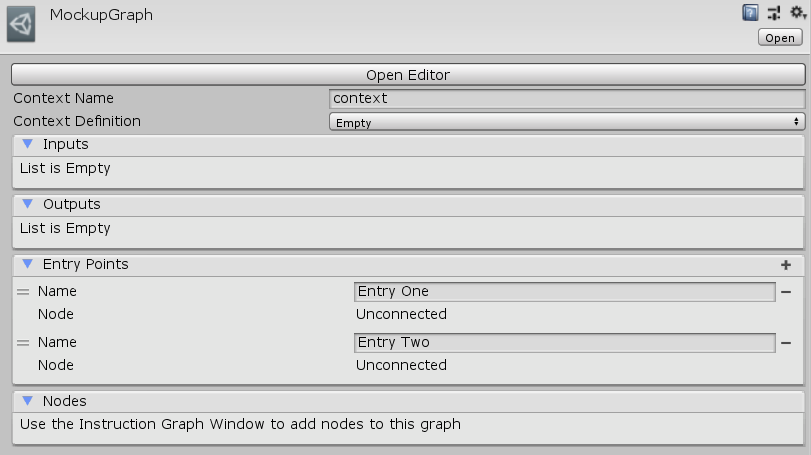

[#manual/mockup-graph]

## Mockup Graph

A Mockup Graph is an implementation of an <<manual/instruction-graph.html,Instruction Graph>> usually used for storyboarding and prototyping in conjunction with <<manual/mockup-node.html,Mockup Nodes>>. A Mockup Graph can be customized to have any number of entry points and are useful to create as a visual template that is turned into a real <<manual/instruction-graph.html,Instruction Graph>> later.

See <<topics/graphs-1.html,Graphs>> for more information on instruction graphs. +

### Fields

[cols="1,2"]
|===
| Name	| Description

| Entry Points	| The list of starting <<manual/instruction-graph-node.html,Nodes>> that this graph enters into
|===

ifdef::backend-multipage_html5[]
<<reference/mockup-graph.html,Reference>>
endif::[]