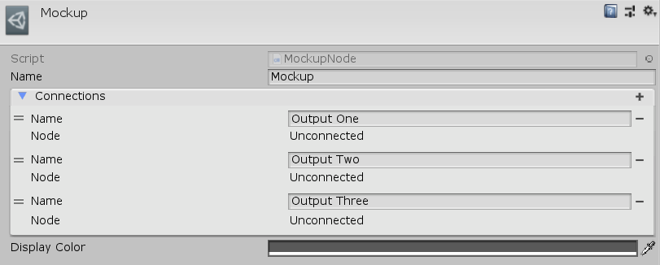

[#manual/mockup-node]

## Mockup Node

A Mockup Node is an <<manual/instruction-graph-node.html,Instruction Graph Node>> usually used in conjunction with a <<manual/mockup-graph.html,Mockup Graph>> for the purpose of storyboarding and prototyping. A Mockup Node can have any number of output _Connections_ to other nodes. Create a Mockup Node in the menu:Create[Debug > Mockup] menu of the Instruction Graph Window.

See <<topics/graphs/overview.html,Graphs>> for more information on instruction graphs. +

### Fields

[cols="1,2"]
|===
| Name	| Description

| Connections	| The list of outputs to other nodes
| Display Color	| The https://docs.unity3d.com/ScriptReference/Color.html[Color^] to display this node as in the Instruction Graph Window
|===

ifdef::backend-multipage_html5[]
<<reference/mockup-node.html,Reference>>
endif::[]