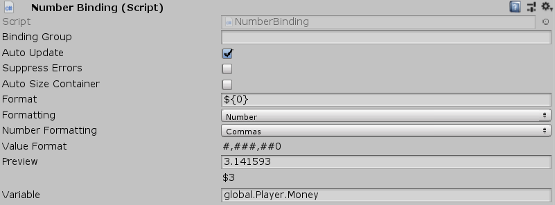

[#manual/number-binding]

## Number Binding

Number Binding is a <<manual/variable-binding.html,Variable Binding>> display text on a sibling http://digitalnativestudios.com/textmeshpro/docs/[TextMeshPro^] component based on bindings to an int or float <<reference/variable-reference.html,VariableReference>> with customized <<reference/binding-formatter.html,Formatting>> applied. If _Variable_ is invalid or does not return an int or float, then the text will be disabled.

See the _"Amount"_ object in the _"Shop"_ scene of the Shop project for an example usage.

### Fields

[cols="1,2"]
|===
| Name	| Description

| Format	| The <<reference/binding-formatter.html,Formatting>> to display the number with
| Variable	| The <<reference/variable-reference.html,VariableReference>> to retrieve the number from
|===

ifdef::backend-multipage_html5[]
<<reference/number-binding.html,Reference>>
endif::[]