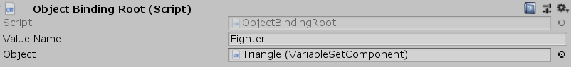

[#manual/object-binding-root]

## Object Binding Root

Object Binding Root is a <<manual/binding-root.html,Binding Root>> that references a specific https://docs.unity3d.com/ScriptReference/Object.html[Object^] and uses it as the binding variables for the child <<manual/variable-binding.html,Variable Bindings>>.

See the _"TriangleDisplay"_ and _"HexagonDisplay"_ objects in the _"Battle"_ scene of the Battle project for an example usage.

### Fields

[cols="1,2"]
|===
| Name	| Description

| Object	| The https://docs.unity3d.com/ScriptReference/Object.html[Object^] to use as a binding for child <<manual/variable-binding.html,Variable Bindings>>
|===

ifdef::backend-multipage_html5[]
<<reference/object-binding-root.html,Reference>>
endif::[]